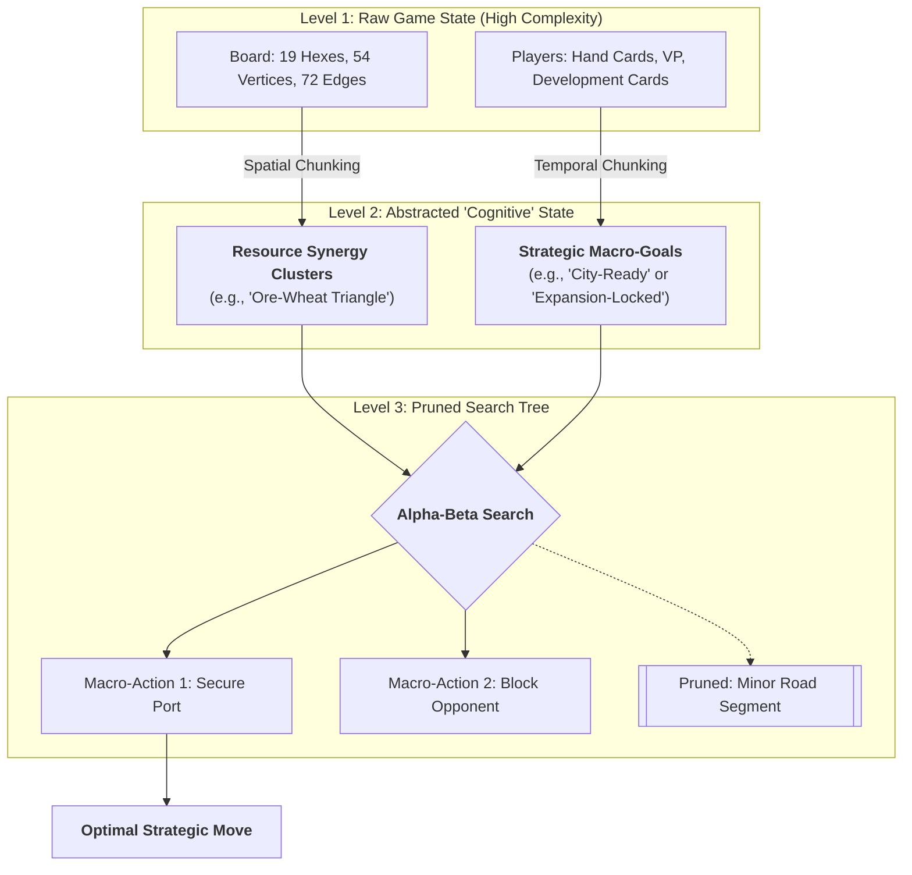

# Abstract Strategy Player
A game playing agent built with human cognition in mind

```mermaid
graph TD
    subgraph "Level 1: Raw Game State (High Complexity)"
        A[Board: 19 Hexes, 54 Vertices, 72 Edges]
        B[Players: Hand Cards, VP, Development Cards]
    end

    A --> |"Spatial Chunking"| C
    B --> |"Temporal Chunking"| D

    subgraph "Level 2: Abstracted 'Cognitive' State"
        C["`**Resource Synergy Clusters**
        (e.g., 'Ore-Wheat Triangle')`"]
        D["`**Strategic Macro-Goals**
        (e.g., 'City-Ready' or 'Expansion-Locked')`"]
    end

    C --> E
    D --> E

    subgraph "Level 3: Pruned Search Tree"
        E{"`**Alpha-Beta Search**`"}
        F[Macro-Action 1: Secure Port]
        G[Macro-Action 2: Block Opponent]
        H[[Pruned: Minor Road Segment]]
        
        E --> F
        E --> G
        E -.-> H
    end
    
    F --> I["`**Optimal Strategic Move**`"]
```